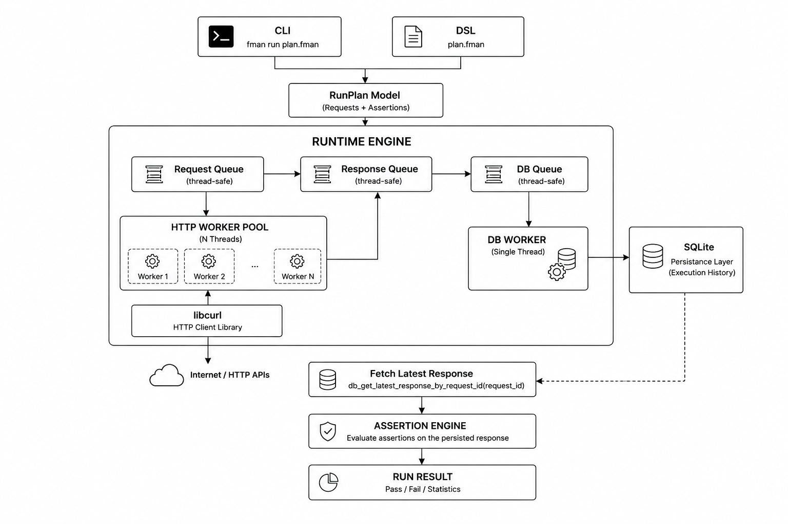
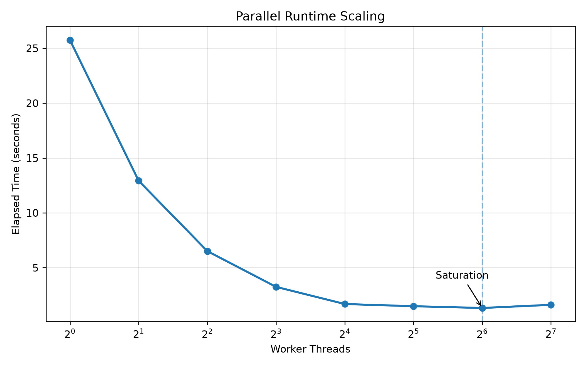
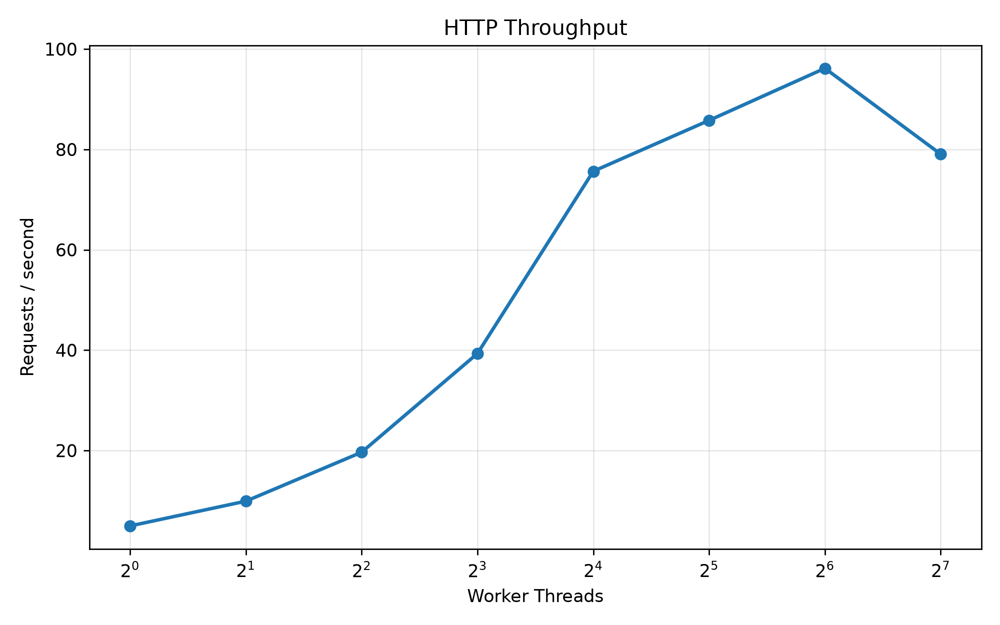
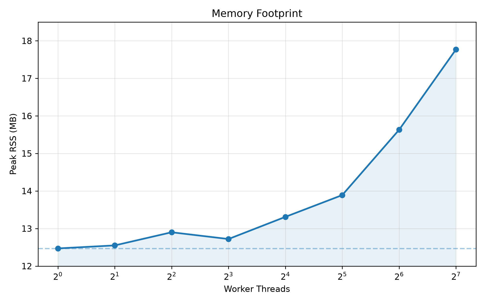

# FMAN

**A lightweight, parallel API testing runtime written in ISO C99.**

 [](https://opensource.org/licenses/MIT) []() []()
<p align="center">
  
</p>

FMAN is not another HTTP client. It is a native execution runtime — CLI and DSL share one parallel engine, one assertion layer, one persistence layer. No Electron. No Node. Native C.

## Architecture

<p align="center">
  
</p>

```
RunPlan → Worker Queue → HTTP Pool (libcurl) → Response Queue → SQLite → Assertions → RunResult
```

## Install

```bash


git clone https://github.com/Honuratus/FMAN.git
cd FMAN

./scripts/install.sh

cmake -S . -B build && cmake --build build
sudo cmake --install build   # optional
```

> Requires: CMake · GCC/Clang · libcurl · SQLite3

## CLI

```bash
fman get https://example.com

fman get https://example.com \
  --expect-status 200 \
  --expect-header "Content-Type" "text/html" \
  --expect-body "Example Domain"

fman get http://127.0.0.1:8080/test.bin \
  --expect-status 200 \
  --expect-body hex:7F8A
```

## DSL

```text
GET https://example.com
EXPECT status 200
EXPECT header Content-Type text/html
EXPECT body contains "Example Domain"

GET https://httpbin.org/json
EXPECT status 200
EXPECT header Content-Type application/json
```

```bash
fman run smoke.fman
```

Handwritten lexer + recursive-descent parser. Produces the same `RunPlan` as the CLI.

## Performance

128 requests · 200 ms artificial latency · local server

<p align="center">
  
</p>

| Workers | Time |
|--------:|-----:|
| 1 | 25.751 s |
| 2 | 12.922 s |
| 4 | 6.511 s |
| 8 | 3.254 s |
| 16 | 1.692 s |
| 32 | 1.492 s |
| **64** | **1.331 s** |
| 128 | 1.619 s |

<p align="center">
  
</p>

Peak throughput: ~96 req/s at 64 workers.

<p align="center">
  
</p>

Peak memory: <18 MB at 128 workers.

## Memory Safety

```
in use at exit: 0 bytes in 0 blocks
4,755 allocs, 4,755 frees — no leaks possible
ERROR SUMMARY: 0 errors from 0 contexts
```

## Development

```bash
./scripts/check.sh
```

Runs configure · build · unit tests · integration tests · smoke tests · Valgrind.

## Roadmap

**Done** — parallel runtime · worker pool · SQLite persistence · CLI · DSL · assertion engine

**Planned** — POST/PUT/PATCH · variables · env files · JSON assertions · auth · collections · HTML reports · JUnit export

## Compared to

| Tool | Runtime |
|------|---------|
| curl | Native |
| Hurl | Native |
| Bruno | Electron |
| Postman | Electron |
| Newman | Node.js |
| **FMAN** | **Native C** |

## Contributing

Follow existing style · keep PRs focused · add tests · `scripts/check.sh` must pass.

MIT License · Built on libcurl, SQLite, POSIX Threads, CMake
